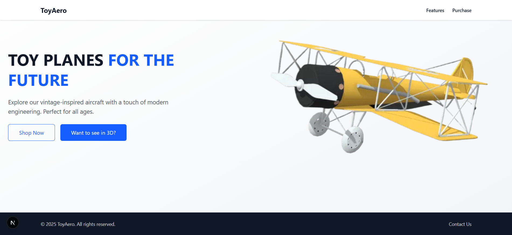
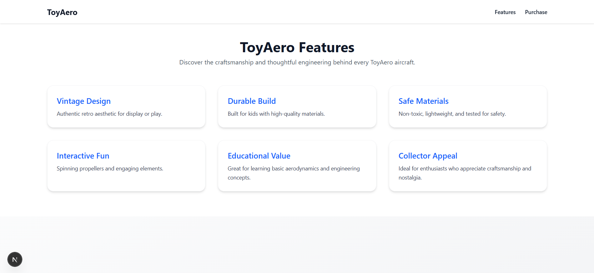
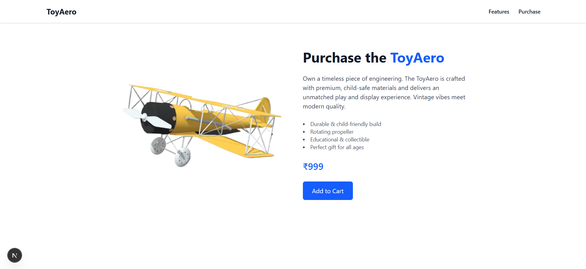

# ✈️ ToyAero – Interactive 3D Toy Plane Website

ToyAero is a modern and interactive product showcase website for a vintage-inspired toy airplane. Built with **Next.js**, **Tailwind CSS**, and **Three.js**, it provides a 3D model viewer, responsive UI, feature highlights, and a purchase section – all crafted with clean animations and styling.

---

## 🚀 Live Demo
> Coming soon – link to your Vercel/GitHub Pages deployment here.

---

## 📸 Screenshots

| Home Page with 3D Toggle | Features Section | Purchase Section |
|--------------------------|------------------|------------------|
|  |  |  |
---

## 🛠️ Tech Stack

- **Framework**: [Next.js](https://nextjs.org/)
- **Styling**: [Tailwind CSS](https://tailwindcss.com/)
- **3D Rendering**: [Three.js](https://threejs.org/) + [@react-three/fiber](https://docs.pmnd.rs/react-three-fiber/)
- **Interactivity**: React, useRef, useState
- **Deployment**: [Vercel](https://vercel.com/) *(recommended)*

---

## ✨ Features

- Interactive 3D Model of Toy Plane (GLB format)
- Toggle between static image and 3D view
- Smooth OrbitControls with auto-reset
- Responsive Layout (Mobile + Desktop)
- Styled Navigation Bar & Sticky Footer
- Feature Highlights Grid
- Purchase CTA section
- Clean, maintainable, and fully commented code

---

## 📁 Folder Structure

```bash
/src
  /app
    /features
      page.jsx         # Features page
    /purchase
      page.jsx         # Purchase page
    layout.jsx         # Root layout with Navbar/Footer
    page.jsx           # Home page (Hero section)
  /components
    Navbar.jsx
    Footer.jsx
    Hero.jsx
    ModelStickyRight.jsx
    FeaturesSection.jsx
/public
  /screenshots         # Screenshots for README
  /vintage_toy_airplane.glb
  /plane-static.png
```

---

## 🧪 Setup & Run Locally

```bash
git clone https://github.com/yourusername/toyaero-website.git
cd toyaero-website
npm install
npm run dev
```

Then visit: [http://localhost:3000](http://localhost:3000)

---

## 📦 Deployment
Deploy this project in 1 click on [Vercel](https://vercel.com/):

```bash
vercel
```
Or connect your GitHub repo to Vercel’s dashboard.
